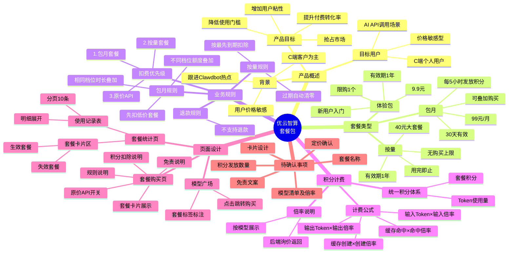

# 优云智算套餐包 PRD 思维导图

## Mermaid 思维导图



---

## 文本结构版思维导图

```
优云智算套餐包 PRD
│
├── 1. 产品概述
│   ├── 背景
│   │   ├── C端客户为主
│   │   ├── 用户具有价格敏感性
│   │   └── 跟进 moltbot/clawdbot 热点
│   ├── 产品目标
│   │   ├── 降低用户使用门槛
│   │   ├── 提升付费转化率和留存率
│   │   ├── 增加用户粘性
│   │   └── 抢占 Clawdbot 用户群体
│   └── 目标用户
│       ├── C端个人用户
│       ├── 价格敏感型
│       └── AI API调用场景
│
├── 2. 套餐类型
│   ├── 体验包
│   │   ├── 价格：9.9元（待定）
│   │   ├── 有效期：1年
│   │   └── 限购：1个
│   ├── 包月
│   │   ├── 价格：99元/月
│   │   ├── 有效期：30天
│   │   ├── 可叠加购买
│   │   └── 每5小时发放积分
│   └── 按量
│       ├── 价格：40元（待定）
│       ├── 有效期：1年
│       └── 无购买上限
│
├── 3. 核心业务规则
│   ├── 扣费优先级
│   │   ├── ① 包月套餐
│   │   ├── ② 按量套餐包
│   │   └── ③ 原价API（开关控制）
│   ├── 按量套餐规则
│   │   ├── 按最先到期优先扣除
│   │   └── 过期未使用自动清零
│   ├── 包月套餐规则
│   │   ├── 相同档位 → 时长叠加
│   │   ├── 不同档位 → 额度叠加（本期不支持）
│   │   └── 先扣低价套餐
│   └── 退款规则
│       └── 不支持退款
│
├── 4. 积分计费系统
│   ├── 统一积分体系
│   │   └── 套餐积分为计费单位
│   └── 计费公式
│       ├── 输入Token × 输入倍率
│       ├── 缓存创建Token × 缓存创建倍率
│       ├── 缓存命中Token × 缓存命中倍率
│       └── 输出Token × 输出倍率
│
├── 5. 套餐元数据
│   ├── package_id（隐藏）
│   ├── package_name
│   ├── package_type（monthly/quota）
│   ├── price
│   ├── available_models
│   ├── description
│   ├── validity_period
│   └── credits_total
│
├── 6. 页面功能设计
│   ├── 套餐购买页
│   │   ├── 套餐列表卡片
│   │   ├── 原价API开关（默认开启）
│   │   ├── 免责说明
│   │   │   ├── 积分不可转让/提现
│   │   │   ├── 有效期及过期清零
│   │   │   └── 服务可用性声明
│   │   ├── 规则说明
│   │   │   ├── 扣费优先级
│   │   │   ├── 叠加规则
│   │   │   └── 常见问题
│   │   └── 积分扣除说明弹窗
│   │       └── 可用模型倍率表格
│   ├── 套餐统计页
│   │   ├── 套餐卡片区
│   │   │   ├── 展示所有套餐（含失效）
│   │   │   ├── 状态标识
│   │   │   └── 设计：姜薇 & 宋博瀚
│   │   └── 使用记录表格
│   │       ├── 字段：时间/模型/APIKEY/套餐ID/Token/额度
│   │       ├── 明细展开功能
│   │       └── 分页：每页10条
│   └── 模型广场页
│       ├── 模型卡片标注套餐类型
│       └── 点击跳转购买页
│
├── 7. 接口需求
│   ├── 获取套餐列表 (GET)
│   ├── 购买套餐 (POST)
│   ├── 获取用户套餐 (GET)
│   ├── 套餐使用记录 (GET)
│   ├── 申请退款 (POST)
│   └── 原价API开关 (PUT)
│
├── 8. 待确认事项
│   ├── 套餐名称 → CC、Renkun
│   ├── 体验套餐定价 → 产品
│   ├── 大套餐定价 → 产品
│   ├── 可用模型清单及倍率 → 后端
│   ├── 包月积分发放数量 → 产品
│   ├── 套餐卡片设计 → 姜薇、宋博瀚
│   ├── 免责说明文案 → 法务/产品
│   └── 模型广场标签设计 → 设计
│
└── 9. 上线计划
    ├── MVP
    │   ├── 99元包月套餐
    │   ├── 体验包套餐
    │   ├── 大额按量套餐
    │   ├── 套餐购买页面
    │   ├── 套餐统计页面
    │   └── 模型广场套餐标注
    └── 后续迭代
        ├── 多档位包月套餐
        ├── 套餐优惠活动
        ├── 续费提醒
        └── 自动续费功能
```

---

## 使用说明

### 查看 Mermaid 思维导图

1. **VS Code**：安装 "Markdown Preview Mermaid Support" 插件
2. **在线工具**：复制 Mermaid 代码到 [mermaid.live](https://mermaid.live)
3. **Typora**：直接支持渲染
4. **GitHub/GitLab**：直接支持渲染

### 导出为图片

1. 访问 https://mermaid.live
2. 粘贴上方 Mermaid 代码
3. 点击导出为 PNG/SVG
