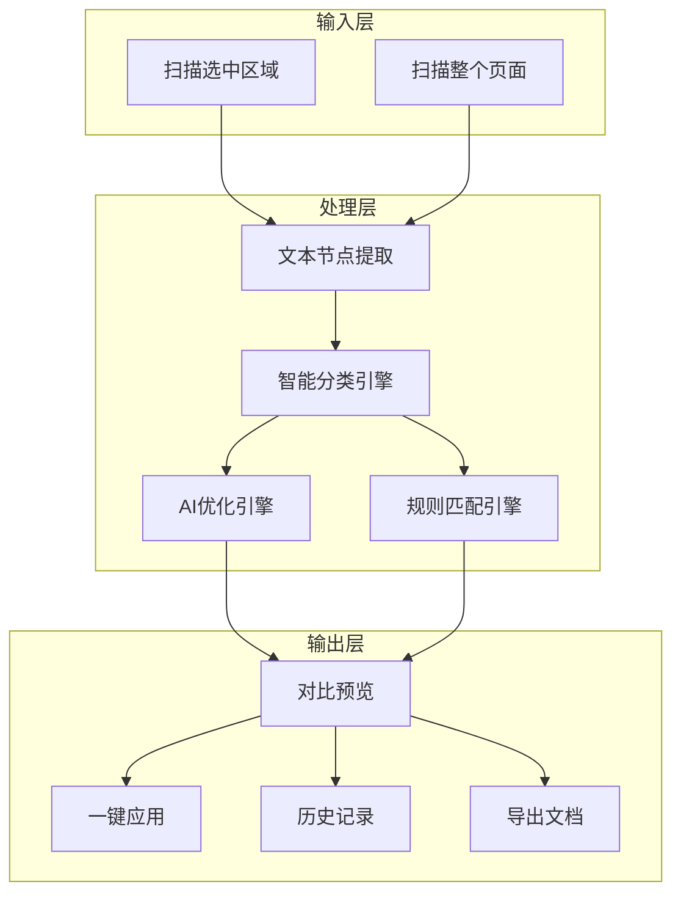
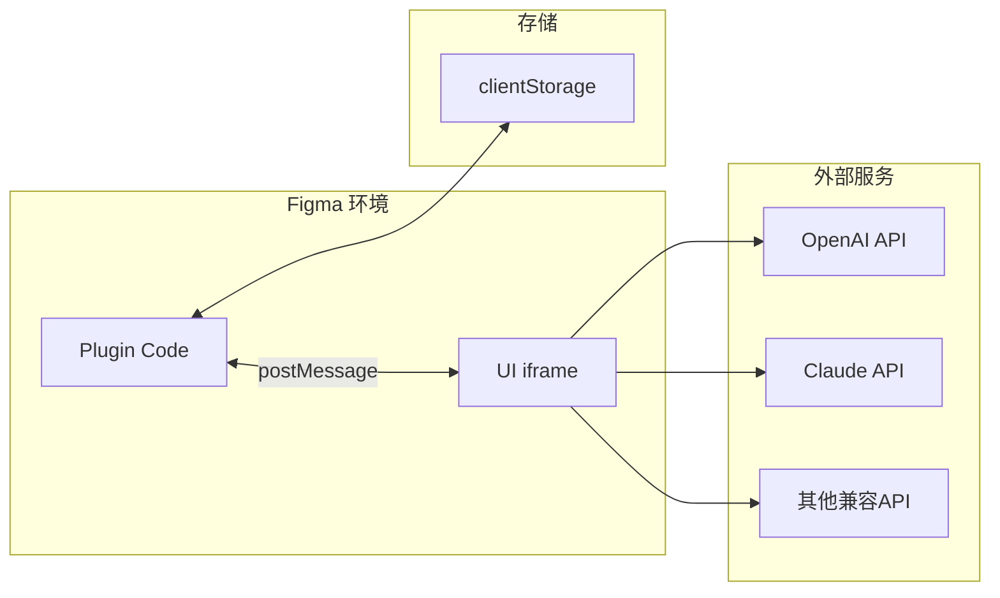

# Figma 文本智能优化插件 - 产品规划文档 (PRD)

## 1. 产品概述

### 1.1 产品定位

一款面向 UI/UX 设计师的 Figma 插件，通过 AI 技术自动识别、分类和优化界面文案，提升设计稿的文案质量和一致性。

### 1.2 目标用户

- UI/UX 设计师
- 产品经理
- 独立开发者
- 设计团队

### 1.3 核心价值

- 减少人工审核文案的时间
- 提升界面文案的专业性和一致性
- 支持品牌规范的文案标准化
- 优化后的文案更符合用户认知，提升认知和体验
- 保证文案调性更符合品牌文化和业务目标

---

## 2. 功能架构




---

## 3. 核心功能详细设计

### 3.1 文本扫描识别


| 功能项   | 描述                          |
| ----- | --------------------------- |
| 扫描范围  | 支持「选中区域」和「整个页面」两种模式         |
| 节点识别  | 递归遍历所有 TextNode 节点          |
| 上下文提取 | 获取父级 Frame/Component 名称作为语境 |
| 元数据采集 | 字体大小、颜色、位置等辅助信息             |


**输出数据结构：**

```typescript
interface TextItem {
  id: string;           // Figma 节点 ID
  characters: string;   // 原始文本内容
  context: string;      // 上下文（父节点名称）
  category: TextCategory; // 分类结果
  fontSize: number;
  position: { x: number; y: number };
}
```

### 3.2 智能文本分类

根据节点上下文和文本特征，自动识别文本类型：


| 分类            | 识别规则                      | 优化策略            |
| ------------- | ------------------------- | --------------- |
| `button`      | 父节点含 btn/button           | 简短有力，动词开头，不超过8字 |
| `title`       | 父节点含 title/header/heading | 清晰准确，突出核心       |
| `description` | 父节点含 desc/subtitle/tip    | 通俗易懂，用户视角       |
| `placeholder` | 父节点含 input/placeholder    | 简洁引导，如"请输入..."  |
| `feedback`    | 父节点含 toast/error/success  | 友好、有帮助、可操作      |
| `label`       | 父节点含 label/form           | 简洁准确，名词形式       |
| `link`        | 父节点含 link/nav             | 明确指向，动宾结构       |
| `general`     | 无法识别                      | 通用优化            |


### 3.3 AI 优化引擎

**支持的 AI 模型：**

- OpenAI GPT-4 / GPT-4o
- Anthropic Claude
- 其他兼容 OpenAI API 格式的模型

**API Key 管理：**

- 用户自行配置 API Key
- 本地存储（Figma clientStorage）
- 支持切换不同模型

**优化 Prompt 模板：**

```
你是一个专业的 UI 文案优化专家。

文本类型：{category}
当前文案：{text}
上下文场景：{context}
品牌词库：{brandTerms}
自定义规则：{customRules}

请优化这段文案，要求：
1. 符合 {category} 类型的最佳实践
2. 保持原意，提升表达质量
3. 遵循品牌用语规范
4. 只返回优化后的文案
```

### 3.4 对比预览


| 展示元素 | 说明              |
| ---- | --------------- |
| 原始文案 | 灰色显示            |
| 优化文案 | 蓝色高亮            |
| 分类标签 | 显示文本类型          |
| 置信度  | AI 优化的置信度评分（可选） |
| 操作按钮 | 应用 / 忽略 / 编辑    |


**交互设计：**

- 点击「应用」直接替换 Figma 中的文本
- 点击「忽略」跳过当前项
- 点击「编辑」可手动修改优化结果后再应用

### 3.5 历史记录与撤销


| 功能   | 描述                          |
| ---- | --------------------------- |
| 记录存储 | 使用 Figma clientStorage 本地存储 |
| 记录内容 | 节点ID、原文、优化后、时间戳             |
| 撤销操作 | 一键还原到原始文案                   |
| 记录上限 | 最近 100 条记录                  |
| 清空功能 | 支持一键清空历史                    |


**数据结构：**

```typescript
interface HistoryRecord {
  id: string;
  nodeId: string;
  nodeName: string;
  original: string;
  optimized: string;
  category: string;
  timestamp: number;
  applied: boolean;
}
```

### 3.6 自定义规则与品牌词库

**品牌词库：**

- 用户可添加品牌专有名词
- 格式：`错误写法 -> 正确写法`
- 示例：`优云 -> 优云智算`、`vip -> VIP`

**自定义规则：**

- 针对特定分类的额外优化指令
- 示例：按钮文案必须以动词开头

**配置界面：**

```
品牌词库：
┌────────────────────────────┐
│ 优云 -> 优云智算           │
│ APP -> App                 │
│ [+ 添加新词条]             │
└────────────────────────────┘

自定义规则：
┌────────────────────────────┐
│ □ 按钮文案不超过6个字       │
│ □ 标题不使用感叹号          │
│ □ 描述文案使用"您"称呼      │
│ [+ 添加新规则]             │
└────────────────────────────┘
```

### 3.7 导出功能

**支持格式：**

- JSON（完整数据）
- CSV/Excel（方便协作）
- Markdown（文档化）

**导出内容：**

```json
{
  "projectName": "项目名称",
  "exportTime": "2026-02-04T12:00:00Z",
  "totalTexts": 42,
  "optimizedTexts": 38,
  "texts": [
    {
      "id": "node-123",
      "category": "button",
      "original": "提交",
      "optimized": "立即提交",
      "context": "登录表单",
      "applied": true
    }
  ]
}
```

---

## 4. 技术架构




**技术栈：**


| 层级    | 技术选型                          |
| ----- | ----------------------------- |
| 插件代码  | TypeScript + Figma Plugin API |
| UI 界面 | HTML/CSS/JavaScript 或 React   |
| 数据存储  | Figma clientStorage           |
| AI 调用 | fetch API (在 UI iframe 中)     |
| 构建工具  | esbuild / Webpack             |


---

## 5. 用户界面设计

### 5.1 主界面布局

```
┌─────────────────────────────────────┐
│  文本智能优化助手            [设置]  │
├─────────────────────────────────────┤
│  [扫描选中]  [扫描整页]  [导出]     │
├─────────────────────────────────────┤
│  筛选: [全部 ▼] [button] [title]... │
├─────────────────────────────────────┤
│                                     │
│  ┌─────────────────────────────┐   │
│  │ [button] 登录表单            │   │
│  │ 原文: 提交                   │   │
│  │ 优化: 立即提交               │   │
│  │ [应用] [忽略] [编辑]         │   │
│  └─────────────────────────────┘   │
│                                     │
│  ┌─────────────────────────────┐   │
│  │ [title] 首页头部             │   │
│  │ 原文: 欢迎使用               │   │
│  │ 优化: 欢迎回来               │   │
│  │ [应用] [忽略] [编辑]         │   │
│  └─────────────────────────────┘   │
│                                     │
│  ... 更多文本项 ...                 │
│                                     │
├─────────────────────────────────────┤
│  已优化 12/42 项    [查看历史]      │
└─────────────────────────────────────┘
```

### 5.2 设置界面

```
┌─────────────────────────────────────┐
│  [<] 设置                           │
├─────────────────────────────────────┤
│                                     │
│  AI 模型配置                        │
│  ┌─────────────────────────────┐   │
│  │ 模型: [OpenAI GPT-4 ▼]      │   │
│  │ API Key: [••••••••••]       │   │
│  │ [测试连接]                  │   │
│  └─────────────────────────────┘   │
│                                     │
│  品牌词库                           │
│  ┌─────────────────────────────┐   │
│  │ 优云 -> 优云智算        [x] │   │
│  │ APP -> App              [x] │   │
│  │ [+ 添加词条]                │   │
│  └─────────────────────────────┘   │
│                                     │
│  优化规则                           │
│  ┌─────────────────────────────┐   │
│  │ ☑ 按钮文案不超过6字         │   │
│  │ ☑ 使用"您"而非"你"          │   │
│  │ ☐ 禁止使用感叹号            │   │
│  │ [+ 添加规则]                │   │
│  └─────────────────────────────┘   │
│                                     │
│  [保存设置]                         │
└─────────────────────────────────────┘
```

---

## 6. 开发阶段规划

### Phase 1: MVP（核心功能）

- 文本扫描识别（选中/整页）
- 基础分类引擎
- AI 优化（支持 OpenAI）
- 对比预览与应用
- API Key 配置

### Phase 2: 增强功能

- 多模型支持（Claude 等）
- 品牌词库
- 自定义规则
- 历史记录与撤销

### Phase 3: 完善体验

- 导出功能
- 优化建议评分
- 使用数据统计
- Figma 社区发布

---

## 7. 文件结构规划

```
figma-text-optimizer/
├── manifest.json           # 插件配置文件
├── package.json            # 项目依赖
├── tsconfig.json           # TypeScript 配置
├── src/
│   ├── code.ts             # 插件主代码（Figma API）
│   ├── ui/
│   │   ├── index.html      # UI 入口
│   │   ├── App.tsx         # 主组件
│   │   ├── components/
│   │   │   ├── TextList.tsx
│   │   │   ├── TextItem.tsx
│   │   │   ├── Settings.tsx
│   │   │   ├── History.tsx
│   │   │   └── Export.tsx
│   │   └── styles/
│   │       └── main.css
│   ├── services/
│   │   ├── ai.ts           # AI API 调用
│   │   ├── classifier.ts   # 文本分类
│   │   └── storage.ts      # 数据存储
│   ├── types/
│   │   └── index.ts        # 类型定义
│   └── utils/
│       └── helpers.ts      # 工具函数
└── README.md               # 使用说明
```

---

## 8. 发布检查清单

发布到 Figma 社区前需完成：

- 功能完整性测试
- UI 适配深色/浅色模式
- 错误处理和用户提示
- API Key 安全存储
- 插件图标和封面设计
- 使用文档编写
- 隐私政策说明（涉及 AI API 调用）
- Figma 审核要求检查

---

## 9. 待确认事项

在开始开发前，请确认以下问题：

1. **UI 框架选择**：是否使用 React，还是纯 HTML/JS？
2. **是否需要多语言支持**：目前规划仅支持中文
3. **免费/付费模式**：是否考虑增值功能？
4. **统计分析**：是否需要匿名使用统计？

